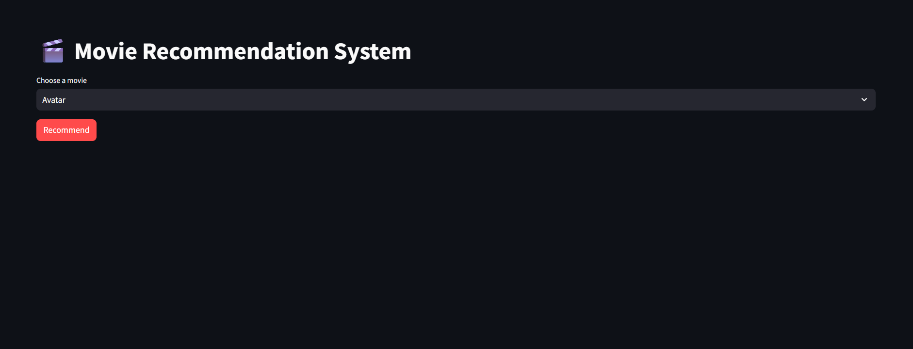
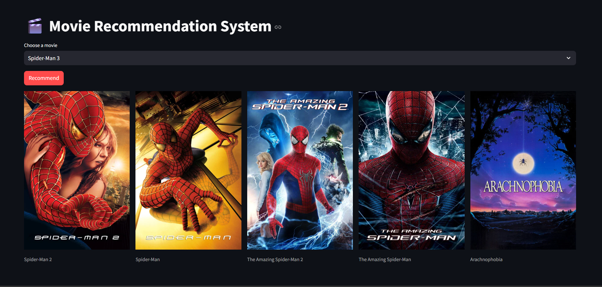

# 🎬 Movie Recommendation System

A **Content-Based Movie Recommendation System** built with **Python**, **Scikit-learn**, and **Streamlit**. The application recommends movies similar to the one selected by the user using  **Cosine Similarity**, while fetching movie posters dynamically from the **TMDB API**.

---

## 🚀 Live Demo

🔗 **Streamlit App:** [Movie Recommendation System](https://movie-recommendation-system-ak.streamlit.app/)

---

## 📸 Application Preview

### 🏠 Home Page



### 🎬 Recommendation Page



---

# ✨ Features

- 🎥 Search from **5000+ movies**
- 🤖 Content-based movie recommendations
- ⭐ Returns the **Top 5 similar movies**
- 🖼️ Fetches movie posters using the TMDB API
- ⚡ Parallel poster loading for faster performance
- ☁️ Deployed using **Streamlit Community Cloud**
- 🤗 Model files hosted on **Hugging Face**

---

# 🛠️ Tech Stack

- Python
- Streamlit
- Pandas
- NumPy
- Scikit-learn
- NLTK
- Requests
- TMDB API
- Hugging Face Hub

---

# 📂 Project Structure

```text
movie-recommendation-system/
│
├── app.py
├── movie_recommend_system.ipynb
├── requirements.txt
├── runtime.txt
├── README.md
├── .gitignore
└── .env (local only)
```

---

# 🧠 How It Works

The recommendation system follows these steps:

1. Load the TMDB Movies and Credits datasets.
2. Merge both datasets.
3. Select important features:
   - Genres
   - Keywords
   - Cast
   - Director
   - Overview
4. Clean and preprocess the data.
5. Apply text stemming using **PorterStemmer**.
6. Convert text into vectors using **CountVectorizer**.
7. Compute movie similarity using **Cosine Similarity**.
8. Recommend the top 5 similar movies.
9. Fetch movie posters dynamically using the TMDB API.

---

# 📊 Machine Learning Pipeline

```text
TMDB Movies Dataset
          │
          ▼
Merge Movies & Credits
          │
          ▼
Feature Selection
(Genres, Cast, Director,
Keywords, Overview)
          │
          ▼
Text Preprocessing
          │
          ▼
Porter Stemming
          │
          ▼
CountVectorizer
(max_features = 5000)
          │
          ▼
Cosine Similarity Matrix
          │
          ▼
Recommendation Engine
          │
          ▼
Streamlit Web Application
```

---

# 📚 Dataset

- TMDB 5000 Movies Dataset
- TMDB 5000 Credits Dataset

---

# ⚙️ Installation

Clone the repository

```bash
git clone https://github.com/Akhilesh-Mogaveer/movie-recommendation-system.git
```

Move into the project directory

```bash
cd movie-recommendation-system
```

Create a virtual environment

### Windows

```bash
python -m venv .venv
.venv\Scripts\activate
```

### Linux / macOS

```bash
python3 -m venv .venv
source .venv/bin/activate
```

Install the dependencies

```bash
pip install -r requirements.txt
```

---

# 🔑 Environment Variables

Create a `.env` file in the project root.

```env
TMDB_API_KEY=YOUR_TMDB_API_KEY
```

Get your free API key from:

https://developer.themoviedb.org/

---

# ▶️ Run the Application

```bash
streamlit run app.py
```

---

# 🤗 Model Files

The recommendation model files are hosted on **Hugging Face** and downloaded automatically when the application starts.

Repository:

https://huggingface.co/Akhileshh1/movie-recommendation-system

---

# 📦 Generated Files

The notebook generates:

- `movies_dict.pkl`
- `similarity.pkl`

These files are used by the Streamlit application for fast recommendations.

---

# 🎯 Future Improvements

- ⭐ Display IMDb/TMDB ratings
- 🎭 Genre filtering
- 📅 Release year filtering
- ❤️ Favorite movies feature
- 🔍 Search autocomplete
- 🌍 Multi-language support
- 🤖 Hybrid recommendation system
- 🎬 Movie trailers

---

# 👨‍💻 Author

**Akhilesh**

- 💼 LinkedIn: https://linkedin.com/in/akhilesh-1109ma
- 💻 GitHub: https://github.com/Akhilesh-Mogaveer

---

# 🙏 Acknowledgements

- TMDB for providing the movie dataset and API.
- Scikit-learn for machine learning utilities.
- Streamlit for rapid web application development.
- Hugging Face for hosting the model files.

---

# ⭐ Support

If you found this project useful, please consider giving it a ⭐ on GitHub!

It helps others discover the project and supports future improvements.